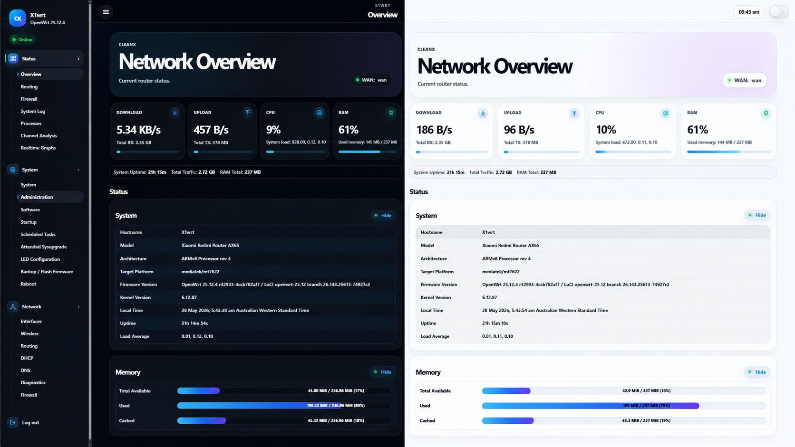
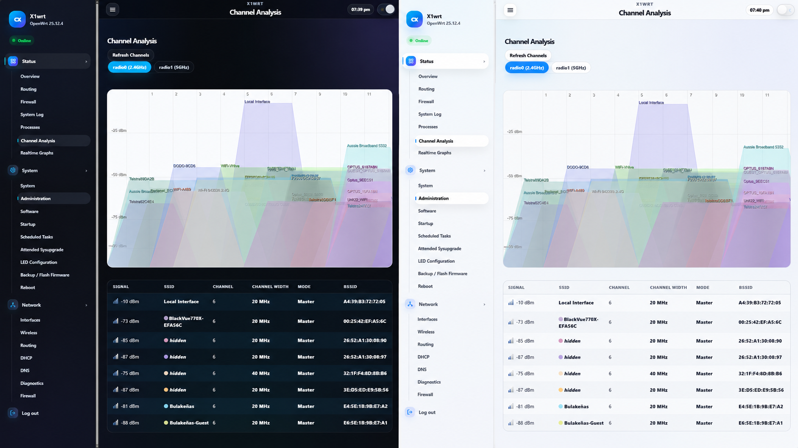
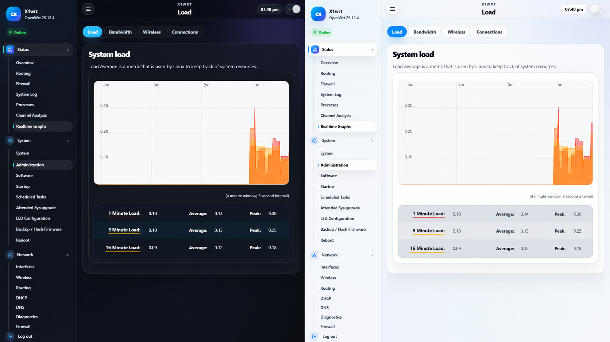

<p align="center">
  
</p>

<h1 align="center">CleanX LuCI Theme</h1>

<p align="center">
  A clean, modern, UniFi-inspired LuCI theme for OpenWrt with polished dark/light mode, responsive navigation and a useful router overview dashboard.
</p>

<p align="center">
  <a href="https://github.com/ox1d3x3/cleanwrt-luci/actions/workflows/build-openwrt-packages.yml">
    
  </a>
  
  
  <a href="https://github.com/ox1d3x3/cleanwrt-luci/releases">
    
  </a>
  <a href="https://github.com/ox1d3x3/cleanwrt-luci/releases">
    
  </a>
  <a href="LICENSE">
    
  </a>
</p>

---

## Preview

### Overview dashboard

<p align="center">
  
</p>

### Channel analysis

<p align="center">
  
</p>

### Realtime graphs - Load

<p align="center">
  
</p>

CleanX is designed to make LuCI feel cleaner, easier to read and more comfortable to use on desktop, tablet and mobile screens. It keeps the normal OpenWrt/LuCI workflow intact while improving the visual layout, spacing, cards, tables, buttons, forms and dashboard output.

## Latest release

<p align="center">
  <a href="https://github.com/ox1d3x3/cleanwrt-luci/releases">
    
  </a>
  <a href="https://github.com/ox1d3x3/cleanwrt-luci/releases">
    
  </a>
  <a href="https://github.com/ox1d3x3/cleanwrt-luci/releases">
    
  </a>
</p>

Download the newest `.ipk` or `.apk` package from the [GitHub Releases](https://github.com/ox1d3x3/cleanwrt-luci/releases) page. The release badge and download counter update automatically from GitHub release metadata, so this section does not need to be edited after every build.

Use the package format that matches your router firmware:

| Router firmware | Recommended package |
| --- | --- |
| OpenWrt 23.05 / 24.10 and other OPKG-based builds | `.ipk` |
| OpenWrt 25.x release or APK-based builds | `.apk` |
| OpenWrt snapshot | Snapshot `.apk` only when it matches your snapshot target |

## Highlights

- Modern dark and light modes with a compact theme switcher.
- Responsive sidebar with clean SVG icons and mobile drawer support.
- Custom login page with matching CleanX styling.
- Live router overview dashboard with WAN speed, traffic totals, CPU usage, RAM usage and uptime.
- Improved LuCI cards, forms, tabs, buttons, tables, modals and CBI sections.
- Cleaner status output for Overview, Network, Wireless, Firewall, System, Processes, Startup, Channel Analysis and Realtime Graphs pages.
- Better handling for long labels, compact controls and crowded LuCI tables.
- OpenWrt SDK based GitHub Actions workflow for `.ipk` and `.apk` package builds.

## Compatibility

CleanX uses the current LuCI theme layout:

```text
ucode/template/themes/cleanx/
```

The package is architecture-independent and is intended for modern OpenWrt/LuCI builds, including:

| Target | Package type |
| --- | --- |
| OpenWrt 23.05 / 24.10 and other OPKG-based builds | `.ipk` |
| OpenWrt 25.x snapshots or APK-based builds | `.apk` |

> Router firmware builds can differ between vendors and snapshots. Keep SSH access available when testing a new LuCI theme so you can recover quickly if the web UI cache or theme selection breaks.

## Repository structure

```text
luci-theme-cleanx/
├── Makefile
├── README.md
├── htdocs/luci-static/cleanx/
│   ├── main.css
│   ├── login.css
│   └── images/logo.svg
├── htdocs/luci-static/resources/
│   ├── menu-cleanx.js
│   └── cleanx-dashboard.js
├── root/etc/uci-defaults/30_luci-theme-cleanx
├── root/usr/share/rpcd/acl.d/luci-theme-cleanx.json
├── ucode/template/themes/cleanx/
│   ├── header.ut
│   ├── footer.ut
│   └── sysauth.ut
├── preview/
├── scripts/
└── .github/workflows/build-openwrt-packages.yml
```

## Install from a release package

Download the latest package from the [Releases](https://github.com/ox1d3x3/cleanwrt-luci/releases) page, then copy it to your router.

### OPKG / `.ipk` builds

```sh
scp luci-theme-cleanx_*.ipk root@192.168.1.1:/tmp/
ssh root@192.168.1.1
opkg install /tmp/luci-theme-cleanx_*.ipk
```

### APK / `.apk` builds

```sh
scp luci-theme-cleanx*.apk root@192.168.1.1:/tmp/
ssh root@192.168.1.1
apk add --allow-untrusted /tmp/luci-theme-cleanx*.apk
```

### Apply CleanX in LuCI

```sh
uci set luci.main.mediaurlbase='/luci-static/cleanx'
uci commit luci
rm -rf /tmp/luci-indexcache /tmp/luci-modulecache
/etc/init.d/uhttpd restart
```

Then refresh LuCI in your browser.

## Build packages with GitHub Actions

1. Fork or upload this repository to GitHub.
2. Open the **Actions** tab.
3. Run **Build CleanX OpenWrt packages**.
4. Download the generated package artifact.

The workflow uses the OpenWrt SDK and creates the matching package output for the selected build target.

CleanX also creates a GitHub **pre-release** after a successful OpenWrt SDK build from `main`, `master` or a manual workflow run. Each pre-release can include package files, build logs, build summaries, release notes and SHA256 checksums.

Stable releases should still be promoted manually after router testing.

See [`RELEASE_PROCESS.md`](RELEASE_PROCESS.md) for the full release process.

## Local preview and QA mocks

After cloning or extracting the repository, open the preview pages directly in a browser:

```text
preview/index.html
preview/qa-v043/index.html
preview/qa-v042/index.html
preview/qa-v031/index.html
```

The QA mocks use fake OpenWrt/LuCI data so theme layout changes can be checked without flashing a router. They are useful for testing the overview dashboard, Network pages, Wireless pages, Firewall output, Package Manager modals and compact mobile top bar behaviour.

## Dashboard behaviour

The overview dashboard reads LuCI RPC data from the router.

Current behaviour:

- WAN speed is calculated from RX/TX byte counter changes.
- Traffic totals are taken from interface counters since boot or interface reset.
- RAM usage comes from `system.info`.
- CPU usage uses `/proc/stat` when available and falls back to a load-based estimate if file RPC is unavailable.
- System uptime updates on the overview dashboard.

For persistent monthly or yearly traffic totals, add `vnstat` or `nlbwmon` in a future release.

## Recovery if LuCI breaks

If the theme causes a layout issue or LuCI becomes unusable, SSH into the router and switch back to the default Bootstrap theme:

```sh
uci set luci.main.mediaurlbase='/luci-static/bootstrap'
uci commit luci
rm -rf /tmp/luci-indexcache /tmp/luci-modulecache
/etc/init.d/uhttpd restart
```

Remove the package if required:

```sh
opkg remove luci-theme-cleanx
```

For APK-based builds:

```sh
apk del luci-theme-cleanx
```

## Development notes

When changing the theme, test both desktop and mobile layouts. LuCI pages can vary heavily depending on installed packages, so it is worth checking common areas such as:

- Status overview
- Network interfaces and devices
- Wireless settings
- Firewall zones and traffic rules
- Channel analysis and realtime graphs
- System administration pages
- Startup, processes and scheduled tasks
- Software and Package Manager modals

Keep user-facing text clean and avoid adding internal prompt or test wording to production files.

## Changelog

### v0.5.9

- Polished top bar alignment so the router name and page title stay visually centred between the menu button and right-side controls.
- Added responsive truncation for long page names on small screens.
- Improved native LuCI dropdown and action compatibility on DNS, Diagnostics, Startup, LED Configuration, System, Load and Processes pages.
- Kept dropdown controls compact by default while allowing long DNS/DHCP lists to open in a more readable layout when focused.
- Cleaned CleanX naming in the LuCI Design list.
- Cleaned duplicate Firewall Zones header output.

### v0.4.3

- Added CPU and RAM cards to the overview dashboard.
- Added a dashboard summary line for system uptime, total traffic and RAM total.
- Restyled Overview Hide/Show controls as modern pills.
- Improved Overview Network and Wireless output readability.
- Improved Package Manager install/details modal dependency layout.
- Added compact top bar controls and a visible SVG mobile menu icon.
- Updated footer project links.
- Added QA mock pages for layout testing.

## Roadmap

- Continue refining LuCI table layouts on dense pages such as Firewall and Network Devices.
- Add more screenshots and mobile previews.
- Add more automated packaging checks for OPKG and APK targets.
- Improve dashboard support for optional traffic history tools such as `vnstat` or `nlbwmon`.

## Author

Created and maintained by [@ox1d3x3](https://github.com/ox1d3x3).

Project repository: [ox1d3x3/cleanwrt-luci](https://github.com/ox1d3x3/cleanwrt-luci)

## Licence

CleanX is released under the [Apache-2.0 Licence](LICENSE).
